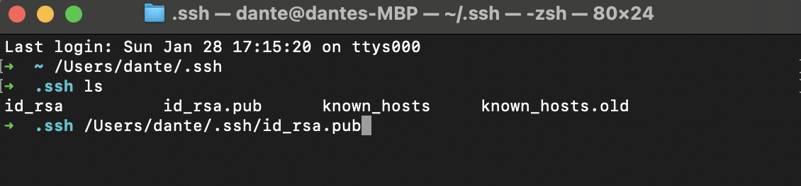

# Lab Report 2

## Part 1: 
#### Chat Server Code: 

#### add message function: 

When the server is activated, the methods Chat and ChatServer are called. 
The method chat is used to store and parse the input from the url query.
The ChatServer method handles the actual launching of the local webserver. 
The only relevant argument will be in the Chat method that takes in the url to parse the query. 
The chat method uses local string array variables to store the query and seperate them into a users and messages array. 
The values of these fields will update the chat history string that gets displayed on the home page. 
The relevant values to the chat server are `String s`, `String user`, `URI url`, `String[] param`, `String[] users`, `String[] messages`,
`String message`, `String user`, and `String chat`. 
Upon every `/add-message...` url request, the relevant values will update and be displayed upon returning to the home page. 

## Part 2: 

#### private key: 

#### public key: 

#### terminal interaction: 

## Part 3: 
Something that I learned from lab in the past two weeks is generating and copying ssh keys between hosts. We can generate a pair of private and public 
ssh keys using the terminal command `ssh-keygen`. We can copy the public ssh key using the `scp` terminal command using the path of the public ssh key 
and the path of the destination on the other host as arguments. 

