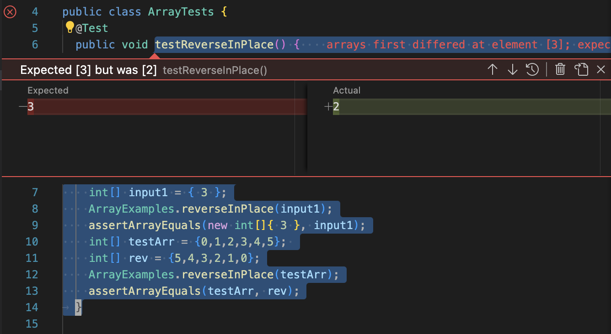

# Lab Report 3

## Part 1 - Bugs: 

In our week 4 lab, we were presented an assortment of jUnit tests and methods to be tested. Some of these jUnit tests failed due to faulty method implentations creating a bug in our program. An example of this can be seen in the array method `reverseInPlace(int[] arr)` with the `testReverseInPlace()` jUnit test. The original jUnit test passes due to the input being provided being an int array with a single value: 
```
@Test
public void testReverseinPlace {
  int[] input1 = {3};
  ArrayExamples.reverseInPlace(input1);
  assertArrayEquals(new int[]{3}, input1);
}
```
The test then fails as soon as we introduce a larger sized int array thus indicating a bug in our program: 
```
@Test
public void testReverseInPlace() {
    int[] testArr = {0,1,2,3,4,5}; 
    int[] rev = {5,4,3,2,1,0};
    ArrayExamples.reverseInPlace(testArr);
    assertArrayEquals(testArr, rev);
}
```
### The symptom: 




### The bug: 

original code: 
```
static void reverseInPlace(int[] arr) {
    for(int i = 0; i < arr.length; i += 1) {
      arr[i] = arr[arr.length - i - 1];
    }
}
```
updated code: 
```
static void reverseInPlace(int[] arr) {
    int element; 
    for(int i = 0; i < arr.length/2; i++) { 
      element = arr[i];
      arr[i] = arr[arr.length - i - 1]; 
      arr[arr.length - i - 1] = element; 
    }
}
```

In the original code block, the inputted int array will begin to reverse but as soon as it gets to the midway point it will start to repeat. Meaning if given the array `int [] testArr = {0,1,2,3,4,5};` we should expect to get a reversed array with the values  `int[] rev = {5,4,3,2,1,0}; ` but we are instead given the array, `{5,4,3,3,4,5}` thus presenting a bug in the code. In order to fix this bug, I implemented a local int variable `int element` to store an int value in the int array. This local variable is set in the for loop with `element = arr[i]` and will then swap the elements at the front and back of the array. This is done with `arr[i] = arr[arr.length - i - 1]; ` and `arr[arr.length - i - 1] = element;` and we set the for loop to traverse through half of the array.  

## Part 2 - Researching Commands: 

### grep options: 

#### -A: 
input: 
```
grep -A 2 "base pair" technical/plos/*.txt
```
output:
```
technical/plos/journal.pbio.0020190.txt:        sequence, which is a specific series of eight base pairs in the DNA of the bacterial
technical/plos/journal.pbio.0020190.txt-        chromosome that stimulate the action of proteins that bring about recombination (Eggleston
technical/plos/journal.pbio.0020190.txt-        and West 1997). Similarly, the immunoglobulin genes of mammals have recombination signal
--
technical/plos/journal.pbio.0020190.txt:        chromosomes, on the order of one or two thousand base pairs of DNA (or less—their length is
technical/plos/journal.pbio.0020190.txt-        difficult to measure), in which recombination events tend to be concentrated. Often they
technical/plos/journal.pbio.0020190.txt-        are flanked by “coldspots,” regions of lower than average frequency of recombination
--
technical/plos/journal.pbio.0020223.txt:        Watson-Crick base pairing, the proximity of the synthetic reactive groups elevates their
technical/plos/journal.pbio.0020223.txt-        effective molarity by several orders of magnitude, inducing a chemical reaction. Because
technical/plos/journal.pbio.0020223.txt-        reactions do not take place between reactants linked to mismatched (noncomplementary) DNA,
```
this command option will print out the inputted number of lines that follows after each match. For this input, I selected 2 lines to print out after a match is found for any text file in the plos subdirectory of technical. 

input: 
```
grep -A 3 "DNA" technical/911report/*.txt
```
output: 
```
technical/911report/chapter-3.txt:                device-to the technicians, as distinctive as DNA. It was a Libyan device. Together
technical/911report/chapter-3.txt-                with other evidence, the FBI put together a case pointing conclusively to the Libyan
technical/911report/chapter-3.txt-                government. Eventually Libya acknowledged its responsibility.
```
Here we are using the `-A` command option again to print out the 3 trailing lines after a match for the term "DNA" is found in any text file in the 911report subdirectory of technical. 

Source: manual page of grep

#### -E:
input: 
```
grep -E "DNA|food" technical/911report/*.txt
```
output:
```
technical/911report/chapter-3.txt:                device-to the technicians, as distinctive as DNA. It was a Libyan device. Together
technical/911report/chapter-5.txt:                demands on its participants, who received the best food and other amenities to
technical/911report/chapter-5.txt:                to note whether the flight attendants brought food into the cockpit. KSM, Khallad,
technical/911report/chapter-7.txt:                Bayoumi and Caysan Bin Don at a halal food restaurant on Venice Boulevard in Culver
technical/911report/chapter-7.txt:                everyday aspects of life in the West, such as purchasing clothes and ordering food.
```
This command option allows to treat the grep command like the egrep command which will allow us to search for multiple patterns at once. In this first example, I am seaching for the terms "DNA" and "food" in every text file of the 911report subdirectory of technical. 
input:
```
grep -E "banana|base pair" technical/plos/*.txt
```
output:
```
technical/plos/journal.pbio.0020190.txt:        sequence, which is a specific series of eight base pairs in the DNA of the bacterial
technical/plos/journal.pbio.0020190.txt:        chromosomes, on the order of one or two thousand base pairs of DNA (or less—their length is
technical/plos/journal.pbio.0020223.txt:        Watson-Crick base pairing, the proximity of the synthetic reactive groups elevates their
```
This example is using the `-E` option to search for the terms "banana" and "base pair" in every text file of the plos subdirectory of technical. 

source: manual page of grep 

#### -o: 
input: 
```
grep -o "WE HAVE SOME PLANES" technical/911report/*.txt
```
output: 
```
technical/911report/chapter-1.txt:WE HAVE SOME PLANES
```
The `-o` command option will display only the matching part of the line of the given input. In this example, I wanted to find a match for the pattern, "WE HAVE SOME PLANES" in every text file of the 911report subdirectory of technical. 

input:
```
grep -o "Charles Darwin" technical/plos/*.txt 
```
output:
```
technical/plos/journal.pbio.0020046.txt:Charles Darwin
technical/plos/journal.pbio.0020311.txt:Charles Darwin
technical/plos/journal.pbio.0020347.txt:Charles Darwin
technical/plos/journal.pbio.0020439.txt:Charles Darwin
```
In this example, I used the `-o` command option to find matches for the pattern "Charles Darwin" in every text file of the plos subdirectory of technical. 

source: manual page of grep

#### -c: 
input:
```
grep -c "plane" technical/911report/*.txt
```
output:
```
technical/911report/chapter-1.txt:71
technical/911report/chapter-10.txt:1
technical/911report/chapter-11.txt:8
technical/911report/chapter-12.txt:4
technical/911report/chapter-13.1.txt:1
technical/911report/chapter-13.2.txt:21
technical/911report/chapter-13.3.txt:2
technical/911report/chapter-13.4.txt:19
technical/911report/chapter-13.5.txt:18
technical/911report/chapter-2.txt:0
technical/911report/chapter-3.txt:9
technical/911report/chapter-5.txt:32
technical/911report/chapter-6.txt:3
technical/911report/chapter-7.txt:31
technical/911report/chapter-8.txt:5
technical/911report/chapter-9.txt:26
technical/911report/preface.txt:0
```
The `-c` command option will provide a count of how many times our inputted pattern appears. In this example, I searched for how many times the pattern "plane" appeared in all of the text files of 911report subdirectory of technical and the output was the count of how many times "plane" appeared in each text file in the subdirectory. 

input:
```
grep -c "airport" technical/911report/*.txt
```
output:
```
technical/911report/chapter-1.txt:13
technical/911report/chapter-10.txt:1
technical/911report/chapter-11.txt:4
technical/911report/chapter-12.txt:5
technical/911report/chapter-13.1.txt:0
technical/911report/chapter-13.2.txt:5
technical/911report/chapter-13.3.txt:2
technical/911report/chapter-13.4.txt:6
technical/911report/chapter-13.5.txt:14
technical/911report/chapter-2.txt:0
technical/911report/chapter-3.txt:11
technical/911report/chapter-5.txt:5
technical/911report/chapter-6.txt:5
technical/911report/chapter-7.txt:9
technical/911report/chapter-8.txt:2
technical/911report/chapter-9.txt:3
technical/911report/preface.txt:0
```
In this example, I used `-c` command option to find how many times the pattern "airport" appeared in every text file of the 911report subdirectory. This command option is useful for sifting through a large amount of data to find how many times our pattern is found. 

source: manual page of grep
