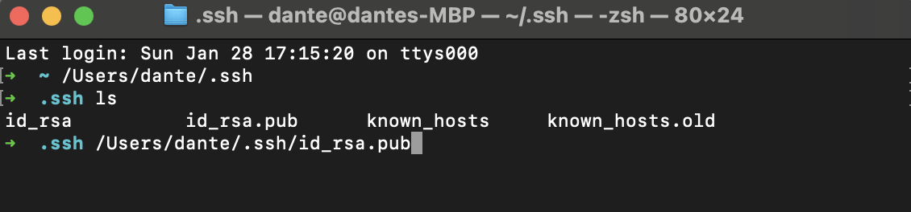
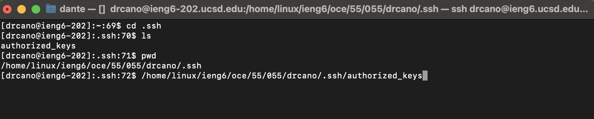
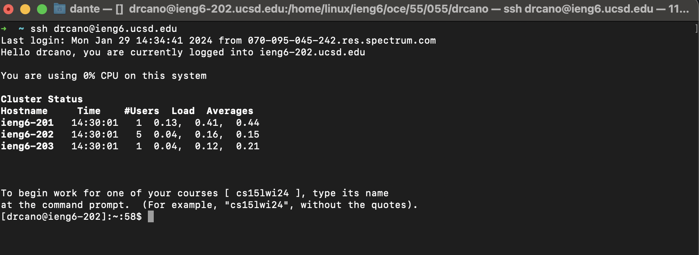

# Lab Report 3

## Part 1 - Bugs: 

In our week 4 lab, we were presented an assortment of jUnit tests and methods to be tested. Some of these jUnit tests failed due to faulty method implentations creating a bug in our program. An example of this can be seen in the array method `reverseInPlace(int[] arr)` with the `testReverseInPlace()` jUnit test. The original jUnit test passes due to the input being provided being an int array with a single value: 
```
@Test
public void testReverseinPlace {
  int[] input1 = {3};
  ArrayExamples.reverseInPlace(input1);
  assertArrayEquals(new int[]{3}, input1); 
```
The test then fails as soon as we introduce a larger sized int array thus indicating a bug in our program: 
```
@Test
public void testReverseInPlace() {
    int[] testArr = {0,1,2,3,4,5}; 
    int[] rev = {5,4,3,2,1,0};
    ArrayExamples.reverseInPlace(testArr);
    assertArrayEquals(testArr, rev);
	}
```
### The symptom: 
//screenshot of test passing
// ss of test failing

### The bug: 

original code: 
```
static void reverseInPlace(int[] arr) {
    for(int i = 0; i < arr.length; i += 1) {
      arr[i] = arr[arr.length - i - 1];
    }
  }
```
updated code: 
```
static void reverseInPlace(int[] arr) {
    int element; 
    for(int i = 0; i < arr.length/2; i++) { 
      element = arr[i];
      arr[i] = arr[arr.length - i - 1]; 
      arr[arr.length - i - 1] = element; 
    }
  }
```

In the original code block, the inputted int array will begin to reverse but as soon as it gets to the midway point it will start to repeat. Meaning if given the array `int [] testArr = {0,1,2,3,4,5};` we should expect to get a reversed array with the values  `int[] rev = {5,4,3,2,1,0}; ` but we are instead given the array, `{5,4,3,3,4,5}` thus presenting a bug in the code. In order to fix this bug, I implemented a local int variable `int element` to store an int value in the int array. This local variable is set in the for loop with `element = arr[i]` and will then swap the elements at the front and back of the array. This is done with `arr[i] = arr[arr.length - i - 1]; ` and `arr[arr.length - i - 1] = element;` and we set the for loop to traverse through half of the array.  

## Part 2: 

#### private key: 


#### public key: 


#### terminal interaction: 


## Part 3: 
Something that I learned from lab in the past two weeks is generating and copying ssh keys between hosts. We can generate a pair of private and public 
ssh keys using the terminal command `ssh-keygen`. We can copy the public ssh key using the `scp` terminal command using the path of the public ssh key 
and the path of the destination on the other host as arguments. 


