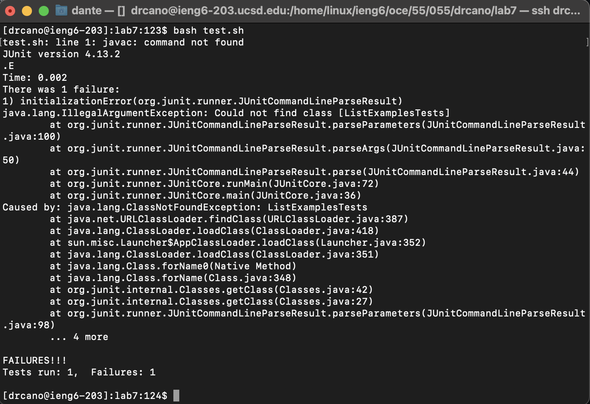
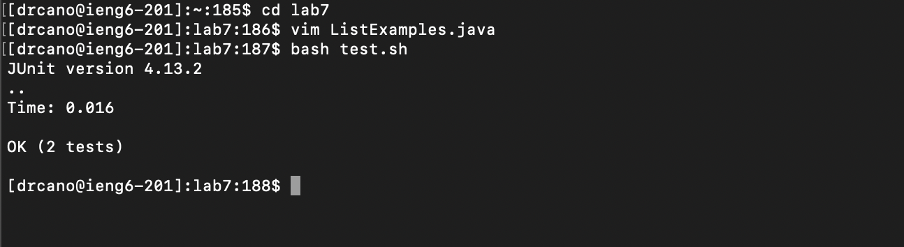

# Lab Report 4: Vim

### Log into ieng6
input: `ssh drcano@ieng6.ucsd.edu`

output: 

### Clone your fork of the repository from your Github account (using the SSH URL) 
input: `git clone https://github.com/drcano/lab7.git`

output: 

### Run the tests, demonstrating that they fail
input: `cd lab7` -> `bash test.sh`

output: 

### Edit the code file to fix the failing test
input: `vim ListExamples.java` -> `/index1` -> `<n>` (x9) -> `<e>` -> `<r>` -> `2` -> `:wq!`

output: 

### Run the tests, demonstrating that they now succeed
input: `<up><up><enter>` 

output: 

### Commit and push the resulting change to your Github account

input: `git commit -am "new update"` ; `git push` 

output: 
