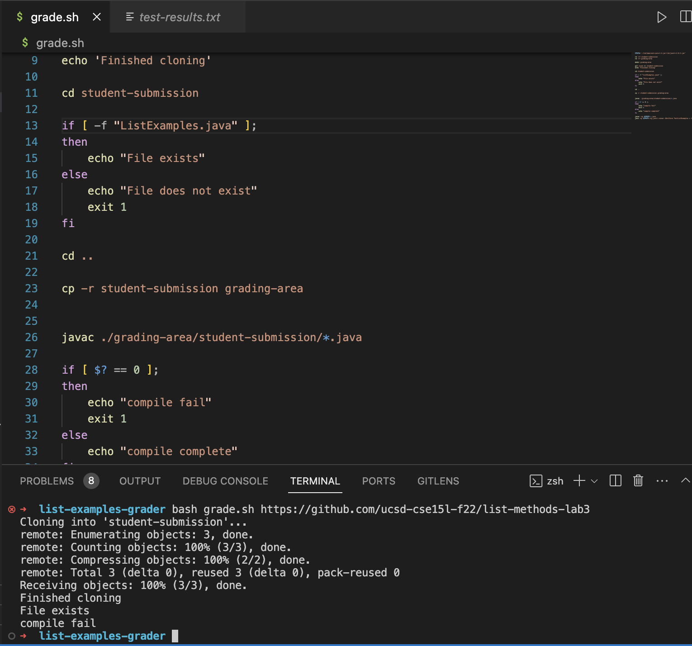
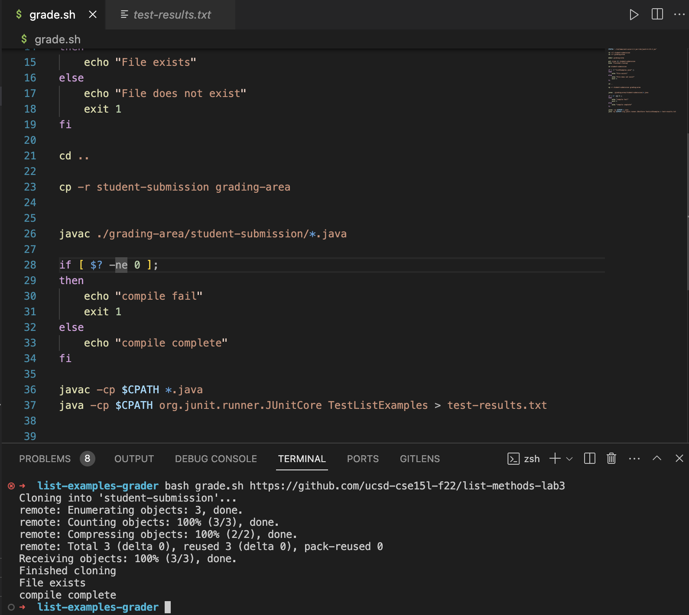

# Part 1: Debugging Scenario: 

## Oringal post: 



hi, i'm trying to run my `grade.sh` file using the bash command and a valid github url (`bash grade.sh [valid github url]`), but when i run my script, the files don't compile using the `javac` command. I'm in the right directory and the file complies if I use the `javac` command outside of the script. I'm not sure why my bash if condition doesn't work and could use some help figuring it out. 

## TA response: 

When you make your comparison in the bash if conditional, are you comparing strings or numbers? Your code is trying to compare the exit code from the `javac ./grading-area/student-submission/*.java` and is looking for an exit code equality with respect to 0. What exit code should a bash command return if the command was successful? I'd suggest reviewing this [stack overflow post](https://stackoverflow.com/questions/20449543/shell-equality-operators-eq) to help with your bug.   

## Student response: 



I reviewed the bash scripting worksheets and the stack overflow post and realized that commands return zero when they are successful. Also on my if conditional, I was using `==` instead of `-eq` since I'm comparing numeric values instead of string values. My other problem was that the if conditional should check if the exit code from the `javac` command is not equal to zero as opposed to being equal to zero. To fix my bug, I changed the original code from `if [ $? == 0 ];` to `if [ $? -ne 0 ];` After doing this, my script was able to successfully run, compile, and save the jUnit test results to a text file. 

## Information: 

### File and Directory structure: 

```
list-examples-grader/
 |- GraderServer.java
 |- Server.java
 |- ListExamples.java
 |- TestListExamples.java
 |- grade.sh
 |- lib/ 
 	|- hamcrest-core-1.3.jar
 	|- junit-4.13.2.jar 
```


### Contents of each relevent file before bug fix: 

#### grade.sh: 
```
CPATH='.:lib/hamcrest-core-1.3.jar:lib/junit-4.13.2.jar'

rm -rf student-submission
rm -rf grading-area

mkdir grading-area

git clone $1 student-submission
echo 'Finished cloning'

cd student-submission

if [ -f "ListExamples.java" ];
then
    echo "File exists"
else
    echo "File does not exist"
    exit 1
fi

cd ..

cp -r student-submission grading-area


javac ./grading-area/student-submission/*.java

if [ $? == 0 ];
then
    echo "compile fail"
    exit 1
else 
    echo "compile complete"
fi

javac -cp $CPATH *.java
java -cp $CPATH org.junit.runner.JUnitCore TestListExamples > test-results.txt

```

#### ListExamples.java:

```
import java.util.ArrayList;
import java.util.List;

interface StringChecker { boolean checkString(String s); }

class ListExamples {

  // Returns a new list that has all the elements of the input list for which
  // the StringChecker returns true, and not the elements that return false, in
  // the same order they appeared in the input list;
  static List<String> filter(List<String> list, StringChecker sc) {
    List<String> result = new ArrayList<>();
    for(String s: list) {
      if(sc.checkString(s)) {
        result.add(s);
      }
    }
    return result;
  }


  // Takes two sorted list of strings (so "a" appears before "b" and so on),
  // and return a new list that has all the strings in both list in sorted order.
  static List<String> merge(List<String> list1, List<String> list2) {
    List<String> result = new ArrayList<>();
    int index1 = 0, index2 = 0;
    while(index1 < list1.size() && index2 < list2.size()) {
      if(list1.get(index1).compareTo(list2.get(index2)) < 0) {
        result.add(list1.get(index1));
        index1 += 1;
      }
      else {
        result.add(list2.get(index2));
        index2 += 1;
      }
    }
    while(index1 < list1.size()) {
      result.add(list1.get(index1));
      index1 += 1;
    }
    while(index2 < list2.size()) {
      result.add(list2.get(index2));
      index2 += 1;
    }
    return result;
  }


}
```

#### TestListExamples.java:
```
import static org.junit.Assert.*;
import org.junit.*;
import java.util.Arrays;
import java.util.List;

class IsMoon implements StringChecker {
  public boolean checkString(String s) {
    return s.equalsIgnoreCase("moon");
  }
}

public class TestListExamples {
  @Test(timeout = 500)
  public void testMergeRightEnd() {
    List<String> left = Arrays.asList("a", "b", "c");
    List<String> right = Arrays.asList("a", "d");
    List<String> merged = ListExamples.merge(left, right);
    List<String> expected = Arrays.asList("a", "a", "b", "c", "d");
    assertEquals(expected, merged);
  }
}

```

### Command line to trigger bug: 

input: `bash grade.sh https://github.com/ucsd-cse15l-f22/list-methods-lab3`

### Bug Fix: 

In order to fix this bug, the second if conditional in the `grade.sh` file needs to be modified. The original code uses a wrong implementation with the if [ $? == 0 ];` statement and needs to be changed to `if [ $? -ne 0 ];` to properly implement the script. 


# Part 2: Reflection

Something that I learned in the second half of the quarter that I thought was really useful was the use of the jdb debugger within the terminal. Most of the times when i'm debugging, I just use the built in debugger within vscode, but the jdb debugger provided a lot more versatility and control as opposed to the vscode debugger. My favorite aspects of the jdb debugger is being able to set the breakpoint at specific locations and print whatever variable I want information on directly in the terminal. This is extremely useful and beneficial not only for debugging code that I am working on, but also reverse engineering code to be able to do fun cool things within java programs. Learning jdb was my favorite part of the course and I wish that we spend more time on it. 


